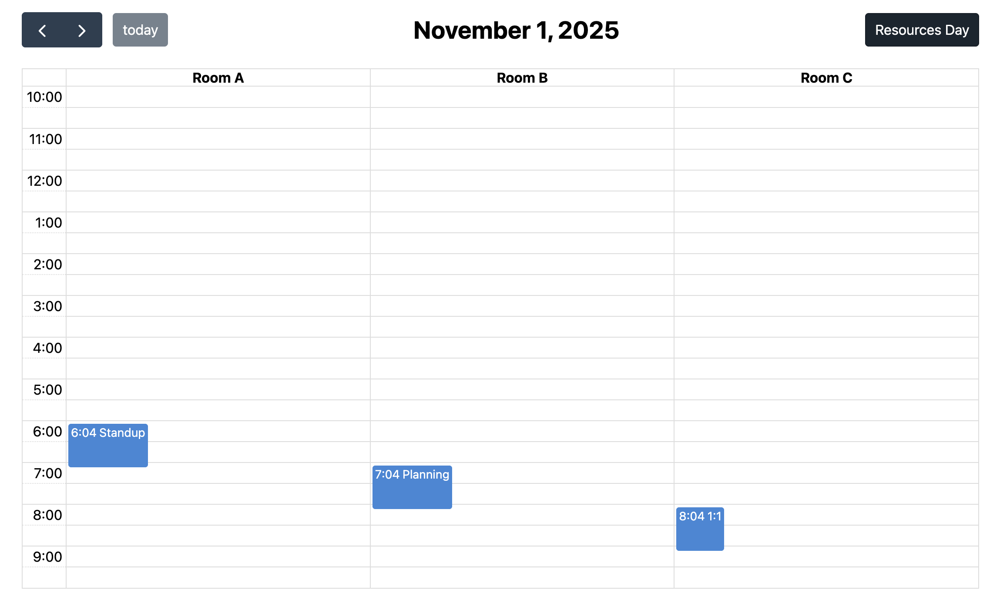

# Resources Grid Day View Plugin for FullCalendar
A custom FullCalendar view that shows a single day split into time slots and multiple resource columns.



## Installation
Install from npm (FullCalendar is required):
- npm: `npm install fc-resources-grid-day`
  
## Usage

```javascript
import { Calendar } from '@fullcalendar/core';
import resourcesGridDayPlugin from 'fc-resources-grid-day';

// Simple demo data
const resources = [
    { id: 'r1', name: 'Room A' },
    { id: 'r2', name: 'Room B' },
    { id: 'r3', name: 'Room C' },
];

const events = [
    { id: 'e1', title: 'Standup', start: new Date(), extendedProps: { id: 'r1' } },
    { id: 'e2', title: 'Planning', start: new Date(new Date().setHours(new Date().getHours() + 1)), extendedProps: { id: 'r2' } },
    { id: 'e3', title: '1:1', start: new Date(new Date().setHours(new Date().getHours() + 2)), extendedProps: { id: 'r3' } },
];

window.addEventListener('DOMContentLoaded', () => {
    const el = document.getElementById('calendar');
    if (!el) return;

    const calendar = new Calendar(el, {
        plugins: [resourcesGridDayPlugin],
        initialView: 'resourcesGridDay',
        nowIndicator: true,
        height: 'auto',
        views: {
            resourcesGridDay: {
                // List of resources is used as columns. 
                // Array of objects { id: string, name: string },
                resourceList: resources,
                
                // Name of the property in event object that contains resource id. String.
                resourceIdProp: 'id',

                // Base timegrid/daytime options used by this view
                slotDuration: '00:30:00',
                slotLabelInterval: '01:00:00',
                slotMinTime: '10:00:00',
                slotMaxTime: '22:00:00',
                slotEventOverlap: true,
                slotLabelFormat: { 
                    hour: 'numeric', 
                    minute: '2-digit', 
                    meridiem: false 
                },
                eventTimeFormat: { 
                    hour: 'numeric', 
                    minute: '2-digit', 
                    meridiem: false 
                },
                
                // Toolbar button text
                buttonText: 'Resources Day'
            },
        },
        events,
    });

    calendar.render();
});
```
